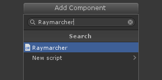
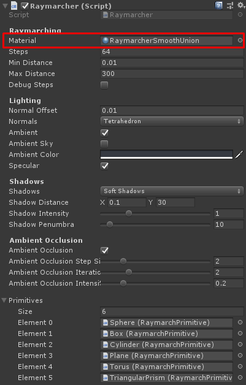
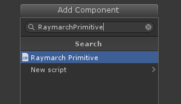
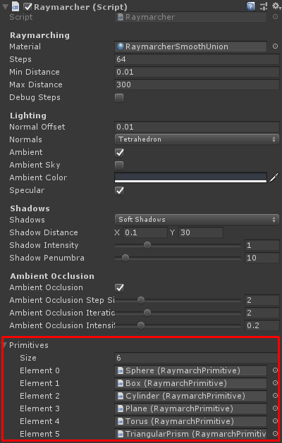

# Raymarching

This repository contains a toolkit to render signed distance functions with raymarching in Unity.

## Installation

The toolkit is structured as a Unity package. To install it in your Unity project follow the next steps:

1. Clone the repository on your machine.
2. Open the file `MyUnityProject/Packages/manifest.json` and add the dependency of the cloned package `"com.aquarterofpixel.raymarching": "file:path/to/Raymarching"`.

## How to use it

1. Attach a `Raymarcher` component to the camera.

2. Select the material used to render. Two materials are included in the package, `RaymarcherUnion` and `RaymarcherSmoothUnion`.

3. Add a `RaymarchPrimitive` component to a gameobject.

4. Select the parameters and material used to render the primitive.

5. Add the `RaymarchPrimitive` component to the primitives list of the `Raymarcher` component.

Now you can move, rotate or scale the raymarch primitive with the Unity transform tools.

## Advanced raymarching

It is also posible to implement a more complex interaction between primitives creating a raymarcher shader. To create a raymarcher shader go to the context menu `Create > Raymarcher Shader`. The shader contains the function `RaymarchData SignedDistanceField(float3 position)` that must be implemented. The function is executed in the fragment shader, iterates over the primitives array and returns the data of the closest one. A library of operations is provided in the files:

* [SignedDistanceOperations.hlsl](ShaderLibrary/SignedDistanceOperations.hlsl)
* [SignedDistanceBooleanOperations.hlsl](ShaderLibrary/SignedDistanceBooleanOperations.hlsl)
