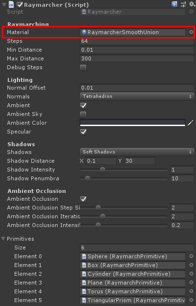
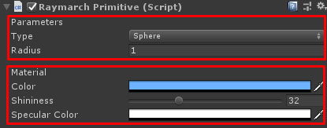

# Raymarching

Library to render signed distance fields with raymarching in Unity.

## Installation

The library is structured as a UPM package and requires the built-in rendering pipeline. To install it in your Unity project follow the next steps:

1. Open the Package Manager.
2. Press the plus button and select "Add package from git URL...".

3. Copy and paste the git repository URL.

## Usage

1. Attach a `Raymarcher` component to the camera.

2. Select the material used to render. Two materials are included in the package, `RaymarcherUnion` and `RaymarcherSmoothUnion`.

3. Add a `RaymarchPrimitive` component to a gameobject.

4. Select the parameters and material used to render the primitive.

5. Add the `RaymarchPrimitive` component to the primitives list of the `Raymarcher` component.

Now you can move, rotate or scale the raymarch primitive with the Unity transform tools.

## Advanced

It is also posible to implement a more complex interaction between primitives creating a raymarcher shader. To create a raymarcher shader go to the context menu `Create > Raymarcher Shader`. The shader contains the function `RaymarchData SignedDistanceField(float3 position)` that is executed in the fragment shader. The function does the following calculations:

1. Iterates over the primitives array.
2. Transforms the target position from world space to the primitive local space.
3. Calculates the distance using the signed distance function of the primitive at the transformed position.
4. The union operator `data.distance = opUnion(data.distance, d)` is applied to the primitives. Other operators can be found in the files [SignedDistanceOperations.hlsl](ShaderLibrary/SignedDistanceOperations.hlsl) and [SignedDistanceBooleanOperations.hlsl](ShaderLibrary/SignedDistanceBooleanOperations.hlsl).
5. Returns the data of the closest primitive.
